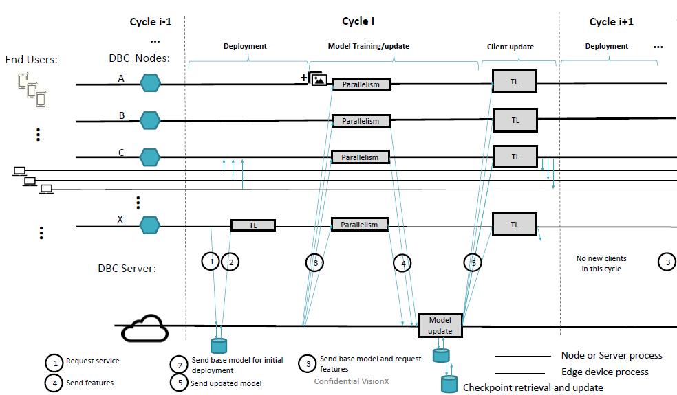
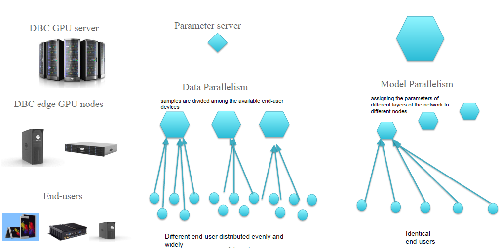

# Federated_Learning
 
A Federated Learning computing framework for deep learning-based AI solution development. 

Provided by DeepBrain Chain, Inc. and VisionX.org

 

  

## About this repository

This is a Python 3 package for the training/testing of deep learning-based models in decentralized computing framework, called Federated Learning (FL). This repository is used by the client side (the computing nodes that do most of the computation) or edge devices rather than the server.  

The PyTorch version currently supported is 1.13.3.

The libraries in this repository can be used in any type of distributed computing for deep learning in any circumstance. It is currently composed of high level modules on top of the deep learning package of PyTorch for the modelling part. One can use the modules to write simplified pipelines for deep learning tasks. 

This repository also serves as a part of our computing framework under the DeepBrain Chain (DBC) cloud on that enables distributed computing throughout the web, utilizing data and model training provided by a collection of users to obtain a collective model result. Multiple architechures of the FL computing framework are developed.

  

## The architectures of the Federated Learning framework

In this project, a Federated Learning framework for deep learning training under the DBC cloud will be established. The main structure of the framework for parallelized computing will include 3 hierarchical layers(figure xx). In a top down order, they are: the central server that does minimal computation, the node layer that does most of the computation, and the end user layer that provide data. Note that there is great uniqueness of this FL framework under the DBC cloud, which already utilizes highly distributed computing devices by collecting free computing resources (GPUs and CPUs) around the world that belong to ordinary device owners. These resources will form the nodes in the node layer, performing affordable computational service for users. 
  

1) Work flow of our FL framework

In our basic FL framework, the models can be continuously updated over cycles. Here transfer learning will be used. The base model from the server in the previous round can be used to do easy training locally with less demand of data. Model update using transfer learning is often coupled with either of the two parallelisms in obtaining the global model.

  
Three architectures can be implemented: data parallelism, model parallelism, and chained distributed computing.

  
Data parallelism is the most commonly used form of parallelism in deep learning. In data parallelism, the data during training is distributed among different nodes. In each cycle, each node trains a model on a specific set of user data, and sends the model to the server. The server will use Federated Averaging to obtain a new model. Of course, local nodes can later use this model to do Transfer Learning (TL) to fit local data, if these data has unique features against other nodes. Data parallelism can be done in synchronized or asynchronized mode, both supported in our proposed project. How the server and different nodes coordinate with each other is largely controlled by the server.  

In model parallelism, the model during training is distributed among different nodes. In certain applications, very deep neural networks may be used (up to 1000 layers). A single node may not have enough capacity to address the training of the whole model. Therefore, each node can be set to perform training of only a subset of layers of the neural network. The data from all relevant end users in the cloud can be sent to the first node, and then perform feed forward and later back propagation throughout subsequent nodes that take care of separate subsets of layers of the neural network. Gradients will be passed between nodes in the back propagation to perform parameter updates. The layers in different nodes will be restacked in the server, giving a final model of the training. 

The chained distributed computing in our framework is a special type. It is similar to data parallelism, except that each node trains a model and pass it to another node to further train the partially trained model. The server will receive the updated model each time a node finished training in order to monitor the model. This form of distributed computing can largely encourage growth of users and bring convenience for users to contribute to the model. Note that in this mode, the edge devices can also perform the computation since the data load is small. Blockchain will be incorporated into this computing architecture, in order to bring security to model updates by users.

  
## User rewards and Blockchain

There will be VNX coin rewards to users of the DBC distributed AI platform. The VNX coins are associated with bitcoin and can be exchanged into dollars. Each valid contribution of data, model, model update, or computing algorithm will be rewarded with assessed value through Smart Contract. This is to establish a large community and support a continuous, active, user-based culture of model development.

  
## What is in this package

1. Modules

This folder has all the essential libraries for the model construction, training, and other important computational algorithms. It is built upon PyTorch. Well-defined neural network configurations are also stored here. 

2. Communication

The communication folder gives the libraries for communications between different parties during the model development process. 

3. Utils

This folder is for certain auxiliary functions needed for performing the computational tasks.

4. Examples

This folder gives some basic examples of scripts to execute under a given framework and architecture.

5. Applications

This folder includes important source codes for the projects on actual industrial applications such as visual defect detection of manufactured products using CNN, coal mine gas level predictions at various locations using LSTM, or speech detection for different dialects using LSTM and CNN, etc.

These applications are very important for this big project. They are the sub-projects that this framework is built for. For each of these applications, the model will continuously be updated and developed by the community through the DBC distributed computing network. As time goes on, new applications will be added. We, along with the community, will continuously expand our application scope and build useful models for every industry.
  

# Please contribute 

The lifeline of this project lies on the contribution of users. Participation in the application projects by contributing data and models is highly encouraged and REWARDED. As an open source project, you are also more than welcome to contribute codes or refine our existing scripts.

  
# Contact
Harry Gu, haisong.gu@deepbrainchain.org     DeepBrain Chain, Inc

Xu Han, xhan415@gmail.com     DeepBrain Chain, Inc

Haoran Yu, haoranyu@deepbrainchain.org     DeepBrain Chain, Inc

Duzhi Chen, duzhichen@visionx.org     DeepBrain Chain, Inc
